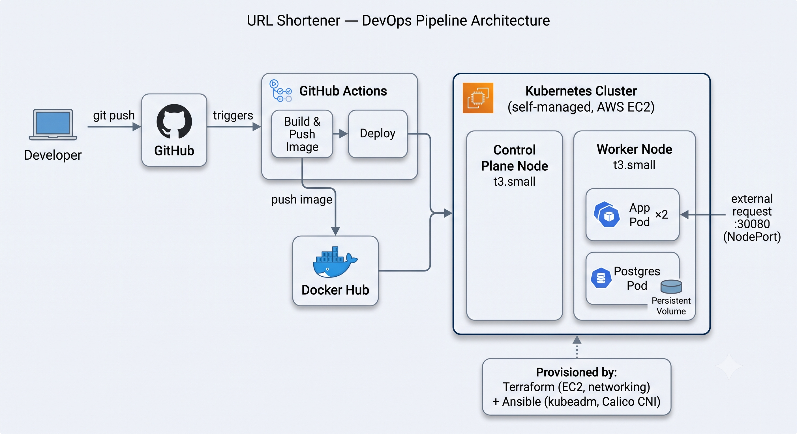

# URL Shortener — End-to-End DevOps Pipeline

A URL shortener with click analytics, built primarily as a vehicle to demonstrate a complete, production-style DevOps pipeline: **Infrastructure as Code, configuration management, container orchestration, and CI/CD — all wired together and working end to end.**

The app itself is intentionally simple. The infrastructure is the point.

---

## What this project demonstrates

- **Terraform** — provisions all AWS infrastructure (EC2 instances, security groups, networking) as code
- **Ansible** — bootstraps a **self-managed Kubernetes cluster** from bare EC2 instances using `kubeadm` (not EKS — chosen deliberately so Ansible has real, meaningful work to do)
- **Docker** — containerizes the application
- **Kubernetes** — orchestrates the app (Deployment, Service, persistent storage for the database) across a 2-node cluster
- **GitHub Actions** — fully automated CI/CD: every push to `main` builds a new image, pushes it to Docker Hub, and rolls it out to the live cluster with zero manual steps

---

## Architecture



**Request flow (once deployed):** an external request hits any node's public IP on the NodePort (`:30080`) → routed by `kube-proxy` to one of two app pod replicas → app pod queries Postgres via its internal Kubernetes Service DNS name (`postgres-service`) → response returned.

---

## Application features

- `POST /shorten` — creates a short link from a long URL, with input validation (rejects malformed URLs), optional custom alias
- `GET /:shortCode` — redirects to the original URL; **responds immediately** and logs the click **asynchronously** (fire-and-forget) so analytics logging never adds latency to the redirect
- `GET /stats/:shortCode` — returns total clicks, the 10 most recent clicks (with user-agent/referrer), and a 7-day clicks-per-day time series
- `GET /health` — liveness/readiness endpoint, used by Kubernetes to detect and recover from unhealthy pods automatically

Click data is stored as **individual rows** (timestamp, user-agent, referrer) rather than a simple counter, specifically so the analytics endpoint can produce a real time series, not just a total.

---

## Infrastructure details

| Layer | Choice | Why |
|---|---|---|
| Cloud | AWS (`ap-south-1`) | — |
| IAM | Dedicated `terraform-deployer` user, scoped to EC2 | Not using root credentials for infra changes |
| Compute | 2× EC2 `t3.small` (1 control plane, 1 worker) | `t3.micro`'s 1GB RAM is below kubeadm's 1.7GB minimum |
| Container runtime | containerd | What Kubernetes actually runs under the hood (Docker is used for local image builds only) |
| Kubernetes | Self-managed via `kubeadm`, not EKS | A managed control plane would make Ansible and much of Terraform redundant — self-managing gives every tool in the stack a genuine job |
| CNI (pod networking) | Calico | Standard, well-documented choice for kubeadm clusters |
| Storage | `local-path-provisioner` + PersistentVolumeClaim | Bare kubeadm clusters have no default StorageClass; this provisions local-disk-backed persistent volumes for Postgres |
| Image registry | Docker Hub | Simple, free, sufficient for a project this size |
| Exposure | Kubernetes `NodePort` (`:30080`) | No cloud load balancer to keep cost at zero; a straightforward next step if this were extended |

---

## CI/CD pipeline

On every push to `main`:

1. **Build job** — checks out code, builds the Docker image, tags it with the Git commit SHA (not `latest` — every deploy is traceable to an exact commit), and pushes to Docker Hub
2. **Deploy job** (waits for build to succeed) — configures `kubectl` against the live cluster using a stored kubeconfig secret, then runs `kubectl set image` to trigger a rolling update, and waits on `kubectl rollout status` to confirm the deployment actually succeeded before marking the pipeline green

No manual deployment step exists — a push to `main` is the only action required to ship a change to production.

---

## Notable engineering problems solved along the way

**Cross-node pod networking failure (Calico / security groups).** After deploying the app, pods scheduled on the worker node were completely unreachable from the control plane — `curl` to both the NodePort and the ClusterIP hung indefinitely, despite `kubectl get pods`, `kube-proxy` logs, and `calico-node` status all looking healthy. Root cause: the security group's inter-node rule only allowed TCP, but Calico's default encapsulation (IP-in-IP) uses a different IP protocol (protocol 4) entirely — invisible to a rule scoped to TCP only. Fixed by opening all protocols (`protocol = "-1"`) between cluster nodes.

**TLS certificate scope mismatch for remote CI/CD access.** `kubeadm init` generates the API server's certificate valid only for addresses known at bootstrap time (the private IP and internal cluster IP) — GitHub Actions, running on GitHub's infrastructure, needed to reach the cluster over its **public** IP, which wasn't a valid certificate SAN. Fixed by regenerating the API server certificate with `kubeadm init phase certs apiserver --apiserver-cert-extra-sans=<public-ip>` and restarting kubelet to pick up the new cert.

**RAM undersizing for kubeadm.** Initial `t3.micro` nodes (1GB RAM) failed `kubeadm init`'s preflight check (1.7GB minimum). Resized to `t3.small` via Terraform — confirmed as a safe in-place update (not a destroy/recreate), preserving all existing Ansible-installed configuration on disk.

---

## Repository structure

```
.
├── .github/workflows/deploy.yml   # CI/CD pipeline
├── terraform/                     # Infrastructure as Code (EC2, security groups)
├── ansible/                       # Cluster bootstrap playbooks (kubeadm, Calico, join)
├── k8s-manifests/                 # Kubernetes resources (Deployments, Services, PVC, Secret)
├── Dockerfile
├── index.js / db.js / schema.sql  # Application code
└── package.json
```

---

## Running this yourself

> Requires: AWS account, Terraform, Ansible (control node), `kubectl`, Docker Hub account.

1. **Provision infrastructure**
   ```bash
   cd terraform
   cp terraform.tfvars.example terraform.tfvars   # fill in your AMI ID, key pair name, IP
   terraform init
   terraform apply
   ```
2. **Bootstrap the cluster** — SSH into the control-plane node, install Ansible, then from `ansible/`:
   ```bash
   ansible-playbook -i inventory.ini common.yml
   ansible-playbook -i inventory.ini init-control-plane.yml
   ansible-playbook -i inventory.ini install-calico.yml
   ansible-playbook -i inventory.ini join-worker.yml
   ```
3. **Deploy the application**
   ```bash
   kubectl apply -f k8s-manifests/
   ```
4. **Set up CI/CD** — add `KUBE_CONFIG` (base64-encoded kubeconfig, public-IP-addressed), `DOCKERHUB_USERNAME`, and `DOCKERHUB_TOKEN` as GitHub repository secrets. From then on, every push to `main` deploys automatically.

---

## Known trade-offs (honest, on purpose)

This is a learning/portfolio project, and a few choices reflect that rather than production best practice:

- SSH and the Kubernetes API port are open to `0.0.0.0/0` rather than a restricted CIDR, due to a highly dynamic home ISP IP — in production this would use a static IP allowlist or AWS Systems Manager Session Manager instead of open SSH
- Database credentials are stored as a Kubernetes Secret with a plain-text value in a public repo — fine for a disposable local-dev password, not a pattern to replicate for real credentials (a real setup would use a secrets manager or Sealed Secrets)
- The app is exposed via NodePort rather than an Ingress controller or cloud load balancer, to keep AWS costs at zero
- No automated test suite runs in CI before deploy — for a project this size that was a deliberate scope cut, not an oversight

---

## Stack summary

`Node.js` `Express` `PostgreSQL` `Docker` `Terraform` `Ansible` `Kubernetes (kubeadm)` `Calico` `GitHub Actions` `AWS EC2` `Docker Hub`
